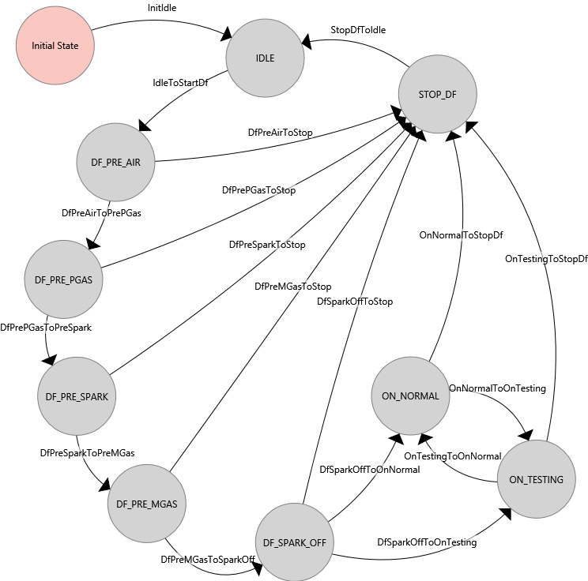

## State Machine Name: HVAC_DF
### States:
* Initial State
* IDLE
* BLOWER
* STOP_BLOWER
* PREHEAT
* HEATING
* STOP_HEAT
* PRECOOL
* COOLING
* STOP_COOL
#### State: Initial State
##### No Entry Actions
##### No Exit Actions
#### State: IDLE
##### Entry Actions
* HvacEnterIdle

##### No Exit Actions
#### State: BLOWER
##### Entry Actions
* HvacEnterBlower

##### No Exit Actions
#### State: STOP_BLOWER
##### No Entry Actions
##### No Exit Actions
#### State: PREHEAT
##### Entry Actions
* HvacEnterPreheat

##### No Exit Actions
#### State: HEATING
##### Entry Actions
* HvacEnterHeating

##### No Exit Actions
#### State: STOP_HEAT
##### Entry Actions
* HvacEnterStopHeat

##### No Exit Actions
#### State: PRECOOL
##### Entry Actions
* HvacEnterPrecool

##### No Exit Actions
#### State: COOLING
##### Entry Actions
* HvacEnterCooling

##### No Exit Actions
#### State: STOP_COOL
##### Entry Actions
* HvacEnterStopCool

##### No Exit Actions
### Transitions:
* InitIdle
* IdleToBlower
* BlowerToStopBlower
* StopBlowerToIdle
* BlowerToPreheat
* BlowerToPrecool
* PreheatToBlower
* PrecoolToBlower
* PreheatToHeating
* HeatingToStopHeat
* StopHeatToHeating
* StopHeatToBlower
* PrecoolToCooling
* CoolingToStopCool
* StopCoolToCooling
* StopCoolToBlower
#### Transition: InitIdle
##### Output Actions
* HvacInit
##### Condition
 IsStartupTimeElapsed
#### Transition: IdleToBlower
##### No Output Actions
##### Condition
 (  IsBlowerRequired AND  CanBlow ) 
#### Transition: BlowerToStopBlower
##### No Output Actions
##### Condition
 ( ! IsBlowerRequired OR ! CanBlow ) 
#### Transition: StopBlowerToIdle
##### No Output Actions
##### Condition
 IsStartupTimeElapsed
#### Transition: BlowerToPreheat
##### No Output Actions
##### Condition
 (  IsInHeatRange AND  CanHeat ) 
#### Transition: BlowerToPrecool
##### No Output Actions
##### Condition
 (  IsInCoolRange AND  CanCool ) 
#### Transition: PreheatToBlower
##### No Output Actions
##### Condition
 ( ! IsInHeatRange OR ! CanHeat ) 
#### Transition: PrecoolToBlower
##### No Output Actions
##### Condition
 ( ! IsInCoolRange OR ! CanCool ) 
#### Transition: PreheatToHeating
##### No Output Actions
##### Condition
 (  IsBlowerOn OR  IsBlowerInDelayedStart ) 
#### Transition: HeatingToStopHeat
##### No Output Actions
##### Condition
 ( ! IsInHeatRange OR ! CanHeat OR  ( ! IsBlowerOn AND ! IsBlowerInDelayedStart )  ) 
#### Transition: StopHeatToHeating
##### No Output Actions
##### Condition
 (  IsInHeatRange AND  CanHeat AND  IsHeatOn AND  (  IsBlowerOn OR  IsBlowerInDelayedStart )  ) 
#### Transition: StopHeatToBlower
##### No Output Actions
##### Condition
! IsHeatOn
#### Transition: PrecoolToCooling
##### No Output Actions
##### Condition
 IsBlowerOn
#### Transition: CoolingToStopCool
##### No Output Actions
##### Condition
 ( ! IsInCoolRange OR ! CanCool OR ! IsBlowerOn ) 
#### Transition: StopCoolToCooling
##### No Output Actions
##### Condition
 (  IsInCoolRange AND  CanCool AND  IsCoolOn AND  IsBlowerOn ) 
#### Transition: StopCoolToBlower
##### No Output Actions
##### Condition
! IsCoolOn

## State Machine Name: Blower_DF
### States:
* Initial State
* IDLE
* PRE-START
* DELAYED_START
* OPEN_DAMPER
* PROVE_AIR
* BLOWER_ON
* DELAYED_STOP
* RECOVER_AIR
#### State: Initial State
##### No Entry Actions
##### No Exit Actions
#### State: IDLE
##### Entry Actions
* BlowerEnterIdle

##### No Exit Actions
#### State: PRE-START
##### Entry Actions
* BlowerEnterPreStart

##### No Exit Actions
#### State: DELAYED_START
##### Entry Actions
* BlowerEnterDelayedStart

##### No Exit Actions
#### State: OPEN_DAMPER
##### Entry Actions
* BlowerEnterOpenDamper

##### No Exit Actions
#### State: PROVE_AIR
##### Entry Actions
* BlowerEnterProveAir

##### No Exit Actions
#### State: BLOWER_ON
##### Entry Actions
* BlowerEnterBlowerOn

##### No Exit Actions
#### State: DELAYED_STOP
##### Entry Actions
* BlowerEnterDelayedStop

##### No Exit Actions
#### State: RECOVER_AIR
##### Entry Actions
* BlowerEnterRecoverAir

##### No Exit Actions
### Transitions:
* InitIdle
* IdleToPreStart
* PreStartToDelayedStart
* PreStartToOpenDamper
* DelayedStartToOpenDamper
* OpenDamperToProveAir
* ProveAirToOpenDamper
* ProveAirToBlowerOn
* BlowerOnToDelayedStop
* BlowerOnToIdle
* DelayedStopToIdle
* DelayedStartToIdle
* DelayedStopToBlowerOn
* BlowerOnToRecoverAir
* RecoverAirToProveAir
* RecoverAirToOpenDamper
* RecoverAirToBlowerOn
* OpenDamperToIdle
* ProveAirToIdle
#### Transition: InitIdle
##### Output Actions
* BlowerInitIdle
##### Condition
 IsStartupTimeElapsed
#### Transition: IdleToPreStart
##### No Output Actions
##### Condition
 IsHvacCallingForBlower
#### Transition: PreStartToDelayedStart
##### No Output Actions
##### Condition
 IsDelayedStartEnabled
#### Transition: PreStartToOpenDamper
##### No Output Actions
##### Condition
! IsDelayedStartEnabled
#### Transition: DelayedStartToOpenDamper
##### No Output Actions
##### Condition
 IsDelayedStartTimerExpired
#### Transition: OpenDamperToProveAir
##### No Output Actions
##### Condition
 IsDamperEndReceived
#### Transition: ProveAirToOpenDamper
##### No Output Actions
##### Condition
! IsDamperEndReceived
#### Transition: ProveAirToBlowerOn
##### No Output Actions
##### Condition
 IsAirProvingReceived
#### Transition: BlowerOnToDelayedStop
##### No Output Actions
##### Condition
 ( ! IsHvacCallingForBlower AND  IsDelayedStopEnabled ) 
#### Transition: BlowerOnToIdle
##### No Output Actions
##### Condition
 ( ! IsHvacCallingForBlower AND ! IsDelayedStopEnabled ) 
#### Transition: DelayedStopToIdle
##### No Output Actions
##### Condition
 IsDelayedStopTimerExpired
#### Transition: DelayedStartToIdle
##### No Output Actions
##### Condition
! IsHvacCallingForBlower
#### Transition: DelayedStopToBlowerOn
##### No Output Actions
##### Condition
 IsHvacCallingForBlower
#### Transition: BlowerOnToRecoverAir
##### No Output Actions
##### Condition
 ( ! IsAirProvingReceived OR ! IsDamperEndReceived ) 
#### Transition: RecoverAirToProveAir
##### No Output Actions
##### Condition
 (  IsRecoverAirTimerExpired AND ! IsAirProvingReceived ) 
#### Transition: RecoverAirToOpenDamper
##### No Output Actions
##### Condition
 (  IsRecoverAirTimerExpired AND ! IsDamperEndReceived ) 
#### Transition: RecoverAirToBlowerOn
##### No Output Actions
##### Condition
 (  IsDamperEndReceived AND  IsAirProvingReceived ) 
#### Transition: OpenDamperToIdle
##### No Output Actions
##### Condition
! IsHvacCallingForBlower
#### Transition: ProveAirToIdle
##### No Output Actions
##### Condition
! IsHvacCallingForBlower

## State Machine Name: Heating_DF
### States:
* Initial State
* IDLE
* DF_PRE_AIR
* ON_NORMAL
* ON_TESTING
* STOP_DF
* DF_PRE_PGAS
* DF_PRE_SPARK
* DF_PRE_MGAS
* DF_SPARK_OFF
#### State: Initial State
##### No Entry Actions
##### No Exit Actions
#### State: IDLE
##### Entry Actions
* HeatEnterIdle

##### No Exit Actions
#### State: DF_PRE_AIR
##### Entry Actions
* HeatEnterPreAir

##### No Exit Actions
#### State: ON_NORMAL
##### Entry Actions
* HeatEnterOnNormal

##### No Exit Actions
#### State: ON_TESTING
##### Entry Actions
* HeatEnterOnTesting

##### No Exit Actions
#### State: STOP_DF
##### No Entry Actions
##### Exit Actions
* HeatExitStopDf

#### State: DF_PRE_PGAS
##### Entry Actions
* HeatEnterPrePGas

##### No Exit Actions
#### State: DF_PRE_SPARK
##### Entry Actions
* HeatEnterPreSpark

##### No Exit Actions
#### State: DF_PRE_MGAS
##### Entry Actions
* HeatEnterPreMGas

##### No Exit Actions
#### State: DF_SPARK_OFF
##### Entry Actions
* HeatEnterSparkOff

##### No Exit Actions
### Transitions:
* InitIdle
* IdleToStartDf
* OnNormalToStopDf
* OnTestingToStopDf
* StopDfToIdle
* DfPreAirToPrePGas
* DfPrePGasToPreSpark
* DfPreSparkToPreMGas
* DfPreMGasToSparkOff
* DfSparkOffToOnNormal
* DfSparkOffToOnTesting
* DfPreAirToStop
* DfPrePGasToStop
* DfPreSparkToStop
* DfPreMGasToStop
* DfSparkOffToStop
* OnNormalToOnTesting
* OnTestingToOnNormal
#### Transition: InitIdle
##### No Output Actions
##### Condition
 IsStartupTimeElapsed
#### Transition: IdleToStartDf
##### No Output Actions
##### Condition
 IsHvacCallingForHeat
#### Transition: OnNormalToStopDf
##### No Output Actions
##### Condition
 ( ! IsHvacCallingForHeat OR ! IsBlowerOn ) 
#### Transition: OnTestingToStopDf
##### No Output Actions
##### Condition
 ( ! IsHvacCallingForHeat OR ! IsBlowerOn ) 
#### Transition: StopDfToIdle
##### No Output Actions
##### Condition
 IsStartupTimeElapsed
#### Transition: DfPreAirToPrePGas
##### No Output Actions
##### Condition
 IsBlowerOn
#### Transition: DfPrePGasToPreSpark
##### No Output Actions
##### Condition
 IsPilotGasInReceived
#### Transition: DfPreSparkToPreMGas
##### No Output Actions
##### Condition
 IsSparkInReceived
#### Transition: DfPreMGasToSparkOff
##### No Output Actions
##### Condition
 IsMainGasInReceived
#### Transition: DfSparkOffToOnNormal
##### No Output Actions
##### Condition
 ( ! IsSparkInReceived AND ! IsTestingModeRequested ) 
#### Transition: DfSparkOffToOnTesting
##### No Output Actions
##### Condition
 ( ! IsSparkInReceived AND  IsTestingModeRequested ) 
#### Transition: DfPreAirToStop
##### No Output Actions
##### Condition
! IsHvacCallingForHeat
#### Transition: DfPrePGasToStop
##### No Output Actions
##### Condition
 ( ! IsHvacCallingForHeat OR ! IsBlowerOn ) 
#### Transition: DfPreSparkToStop
##### No Output Actions
##### Condition
 ( ! IsHvacCallingForHeat OR ! IsBlowerOn ) 
#### Transition: DfPreMGasToStop
##### No Output Actions
##### Condition
 ( ! IsHvacCallingForHeat OR ! IsBlowerOn ) 
#### Transition: DfSparkOffToStop
##### No Output Actions
##### Condition
 ( ! IsHvacCallingForHeat OR ! IsBlowerOn ) 
#### Transition: OnNormalToOnTesting
##### No Output Actions
##### Condition
 IsTestingModeRequested
#### Transition: OnTestingToOnNormal
##### No Output Actions
##### Condition
! IsTestingModeRequested

## State Machine Name: Cooling_DF
### States:
* Initial State
* IDLE
* START_COOLING
* COOL_EVAP
* ON_TESTING
* COOL_STAGE1
* STOP_COOLING
* COOL_STAGE2
* COOL_STAGE3
#### State: Initial State
##### No Entry Actions
##### No Exit Actions
#### State: IDLE
##### Entry Actions
* CoolingEnterIdle

##### No Exit Actions
#### State: START_COOLING
##### Entry Actions
* CoolingEnterStart

##### No Exit Actions
#### State: COOL_EVAP
##### Entry Actions
* CoolingEnterEvap

##### No Exit Actions
#### State: ON_TESTING
##### Entry Actions
* CoolingEnterTest

##### No Exit Actions
#### State: COOL_STAGE1
##### Entry Actions
* CoolingEnterStage1

##### No Exit Actions
#### State: STOP_COOLING
##### No Entry Actions
##### Exit Actions
* CoolingExitStop

#### State: COOL_STAGE2
##### Entry Actions
* CoolingEnterStage2

##### No Exit Actions
#### State: COOL_STAGE3
##### Entry Actions
* CoolingEnterStage3

##### No Exit Actions
### Transitions:
* InitIdle
* IdleToStartCooling
* StartCoolingToEvap
* StartCoolingToOnTesting
* OnTestingToStopCooling
* Stage1ToStopCooling
* EvapToStopCooling
* StopCoolingToIdle
* EvapToStage1
* Stage1ToStage2
* Stage2ToStage3
* Stage2ToStopCooling
* Stage3ToStopCooling
* StartCoolingToStage1
#### Transition: InitIdle
##### Output Actions
* CoolingInitIdle
##### Condition
 IsStartupTimeElapsed
#### Transition: IdleToStartCooling
##### No Output Actions
##### Condition
 IsHvacCallingForCooling
#### Transition: StartCoolingToEvap
##### No Output Actions
##### Condition
 (  IsBlowerOn AND  IsEvapEnabled AND ! IsOaTempTooLowForEvap AND ! IsTestingModeRequested ) 
#### Transition: StartCoolingToOnTesting
##### No Output Actions
##### Condition
 (  IsBlowerOn AND  IsTestingModeRequested ) 
#### Transition: OnTestingToStopCooling
##### No Output Actions
##### Condition
 ( ! IsTestingModeRequested OR ! IsBlowerOn ) 
#### Transition: Stage1ToStopCooling
##### No Output Actions
##### Condition
 ( ! IsHvacCallingForCooling OR ! IsBlowerOn OR  IsTestingModeRequested ) 
#### Transition: EvapToStopCooling
##### No Output Actions
##### Condition
 ( ! IsHvacCallingForCooling OR ! IsBlowerOn OR  IsTestingModeRequested ) 
#### Transition: StopCoolingToIdle
##### No Output Actions
##### Condition
 (  IsAllMinOnTimesExpired OR ! IsQuickStopRequired ) 
#### Transition: EvapToStage1
##### No Output Actions
##### Condition
 (  (  IsEvapHeadStartTimerExpired OR  IsOaTempTooLowForEvap )  AND  IsY1MinOffTimeExpired ) 
#### Transition: Stage1ToStage2
##### No Output Actions
##### Condition
 IsStage2Required
#### Transition: Stage2ToStage3
##### No Output Actions
##### Condition
 IsStage3Required
#### Transition: Stage2ToStopCooling
##### No Output Actions
##### Condition
 ( ! IsHvacCallingForCooling OR ! IsBlowerOn OR  IsTestingModeRequested ) 
#### Transition: Stage3ToStopCooling
##### No Output Actions
##### Condition
 ( ! IsHvacCallingForCooling OR ! IsBlowerOn OR  IsTestingModeRequested ) 
#### Transition: StartCoolingToStage1
##### No Output Actions
##### Condition
 (  IsBlowerOn AND ! IsTestingModeRequested AND  ( ! IsEvapEnabled OR  IsOaTempTooLowForEvap )  ) 

## State Machine Name: Ovrd_Discharge_DF
### States:
* DO_IDLE
* DO_MIN_OVRD_HEAT
* DO_MAX_OVRD_HEAT
* Initial State
* DO_TEMP_RISE_OVRD_HEAT
#### State: DO_IDLE
##### Entry Actions
* EnterDoIdle

##### No Exit Actions
#### State: DO_MIN_OVRD_HEAT
##### Entry Actions
* EnterDoMinOvrdHeat

##### No Exit Actions
#### State: DO_MAX_OVRD_HEAT
##### Entry Actions
* EnterDoMaxOvrdHeat

##### No Exit Actions
#### State: Initial State
##### No Entry Actions
##### No Exit Actions
#### State: DO_TEMP_RISE_OVRD_HEAT
##### Entry Actions
* EnterDoTempRiseOvrdHeat

##### No Exit Actions
### Transitions:
* IdleToMinOvrd
* IdleToMaxOvrd
* MinOvrdToIdle
* MaxOvrdToIdle
* InitToIdle
* IdleToTempRiseOvrd
* TempRiseOvrdToIdle
#### Transition: IdleToMinOvrd
##### No Output Actions
##### Condition
 (  IsStartMinHeatOvrdMet AND ! IsMaxTempRiseExceeded ) 
#### Transition: IdleToMaxOvrd
##### No Output Actions
##### Condition
 (  IsStartMaxHeatOvrdMet AND ! IsMaxTempRiseExceeded ) 
#### Transition: MinOvrdToIdle
##### No Output Actions
##### Condition
 (  IsEndMinHeatOvrdMet OR  IsMaxTempRiseExceeded ) 
#### Transition: MaxOvrdToIdle
##### No Output Actions
##### Condition
 (  IsEndMaxHeatOvrdMet OR  IsMaxTempRiseExceeded ) 
#### Transition: InitToIdle
##### No Output Actions
##### Condition
 IsStartupTimeExpired
#### Transition: IdleToTempRiseOvrd
##### No Output Actions
##### Condition
 IsMaxTempRiseExceeded
#### Transition: TempRiseOvrdToIdle
##### No Output Actions
##### Condition
! IsMaxTempRiseExceeded

## State Machine Name: Freezestat_DF
### States:
* FRZST_TIMED_MONITOR
* FRZST_IDLE
* FRZST_FAIL_RESUME
* FRZST_FAIL_LOCK
#### State: FRZST_TIMED_MONITOR
##### Entry Actions
* EnterMonitor

##### No Exit Actions
#### State: FRZST_IDLE
##### Entry Actions
* EnterIdle

##### No Exit Actions
#### State: FRZST_FAIL_RESUME
##### Entry Actions
* EnterFailResume

##### No Exit Actions
#### State: FRZST_FAIL_LOCK
##### Entry Actions
* EnterFailLock

##### Exit Actions
* ExitFailLock

### Transitions:
* IdleToMonitor
* MonitorToFailResume
* MonitorToFailLock
* FailResumeToIdle
* FailLockToIdle
* MonitorToIdle
#### Transition: IdleToMonitor
##### No Output Actions
##### Condition
 (  IsStartupTimeElapsed AND  IsDischargeTempLow ) 
#### Transition: MonitorToFailResume
##### No Output Actions
##### Condition
 (  IsMonitorTimeExpired AND ! IsResumeCountMaxed ) 
#### Transition: MonitorToFailLock
##### No Output Actions
##### Condition
 (  IsMonitorTimeExpired AND  IsResumeCountMaxed ) 
#### Transition: FailResumeToIdle
##### No Output Actions
##### Condition
 IsStopHvacFlagSet
#### Transition: FailLockToIdle
##### No Output Actions
##### Condition
 IsResetExecuted
#### Transition: MonitorToIdle
##### No Output Actions
##### Condition
 IsDischargeTempRecovered

## State Machine Name: MixingBox_DF
### States:
* MBOX_OFF
* MBOX_IDLE
* MBOX_ON_TEST
* MBOX_ON_PURGE
* MBOX_ON_NORMAL
#### State: MBOX_OFF
##### Entry Actions
* EnterOff

##### No Exit Actions
#### State: MBOX_IDLE
##### Entry Actions
* EnterIdle

##### No Exit Actions
#### State: MBOX_ON_TEST
##### Entry Actions
* EnterOnTest

##### No Exit Actions
#### State: MBOX_ON_PURGE
##### Entry Actions
* EnterOnPurge

##### No Exit Actions
#### State: MBOX_ON_NORMAL
##### Entry Actions
* EnterOnNormal

##### No Exit Actions
### Transitions:
* OffToIdle
* IdleToOff
* IdleToOnTest
* IdleToOnPurge
* IdleToOnNormal
* OnNormalToIdle
* OnPurgeToIdle
* OnTestToIdle
#### Transition: OffToIdle
##### No Output Actions
##### Condition
 (  IsMixboxConfigured AND  IsStartupTimeElapsed ) 
#### Transition: IdleToOff
##### No Output Actions
##### Condition
! IsMixboxConfigured
#### Transition: IdleToOnTest
##### No Output Actions
##### Condition
 IsTestingModeRequested
#### Transition: IdleToOnPurge
##### No Output Actions
##### Condition
 (  IsBlowerOn AND  IsPurgeOn AND ! IsTestingModeRequested ) 
#### Transition: IdleToOnNormal
##### No Output Actions
##### Condition
 (  IsBlowerOn AND ! IsTestingModeRequested AND ! IsPurgeOn ) 
#### Transition: OnNormalToIdle
##### No Output Actions
##### Condition
 ( ! IsMixboxConfigured OR ! IsBlowerOn OR  IsPurgeOn OR  IsTestingModeRequested ) 
#### Transition: OnPurgeToIdle
##### No Output Actions
##### Condition
 ( ! IsBlowerOn OR ! IsPurgeOn OR ! IsMixboxConfigured OR  IsTestingModeRequested ) 
#### Transition: OnTestToIdle
##### No Output Actions
##### Condition
 ( ! IsTestingModeRequested OR ! IsMixboxConfigured ) 

